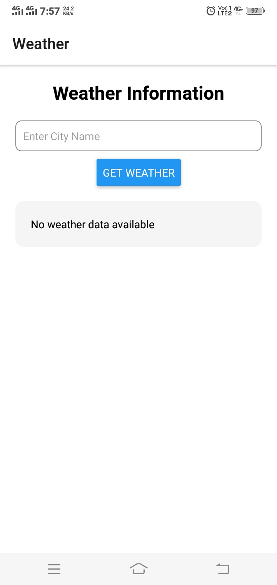
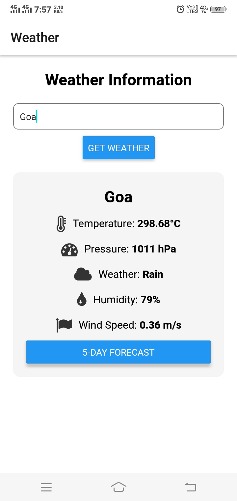
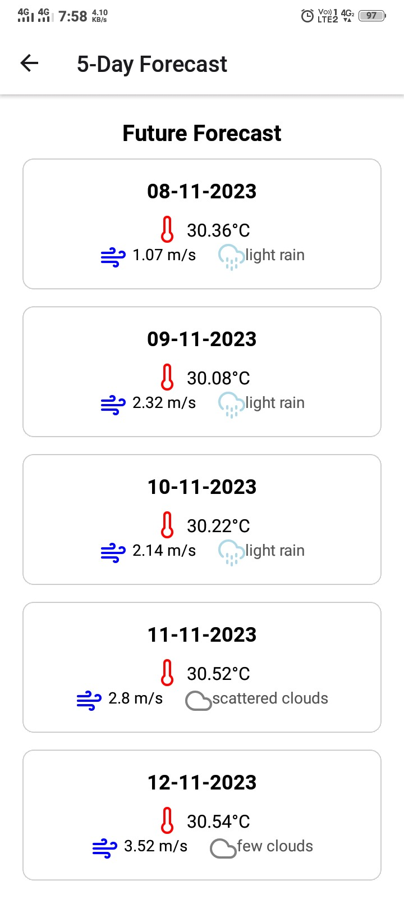

# Weather App

## Description

Welcome to the Weather Forecast App! This mobile application is designed to provide users with weather information for different locations. Users can search for cities and view detailed weather forecasts, including temperature, pressure, humidity, wind speed, and a five-day forecast. This README provides an overview of the app and instructions on how to set it up on your device.

## Project Links

- GitHub: [Weather App Repository](https://github.com/saurabhkumarr99/WeatherForecastingApp)

## Table of Contents

- [Features](#features)
- [Getting Started](#getting-started)
- [Usage](#usage)
- [Code Structure](#code-structure)
- [Screenshots](#screenshots)
- [Author](#Author)

## Features

- **City Search:** Search and view weather information for various cities.
- **Detailed Forecast:** Access detailed weather forecasts including temperature, pressure, humidity, and wind speed.
- **Five-Day Forecast:** View a forecast for the upcoming five days for the selected city.
- **Responsive Design:**  Enjoy a user-friendly experience on both iOS and Android devices.

## Getting Started

### Prerequisites

- Node.js and npm (Node Package Manager) installed on your computer.
- Node.js: [Download and Install Node.js](https://nodejs.org/)

Follow these steps to run the Blog App locally:

1. **Unzip the Video Player App:**

2. **Navigate to the project directory:**

   ```bash
   cd WeatherForecastingApp
   ``` 

2. **Install Dependencies:**

   ```bash
   npm install
   ``` 

3. **Run:**

   ```bash
    npx expo start
   ``` 


## Usage

- **Search Weather**: Use the app to search and view weather information for different cities.
- **View Forecast**: Access detailed weather forecasts for the selected city, including the five-day forecast.

## Code Structure

The project follows a structured directory layout for better organization:

- **allComponents/**: 
  - `AppNavigator.js/`
  - `ForecastList.js`
  - `WeatherCard.js`


- **ScreenShots**: Folder conatining screenshots here.

  - **assets/**: Images, styles, and other assets.
   
  - `App.js`: The main application file that sets up routing and renders components.

- `package.json`: The project dependencies and scripts configuration.

- `README.md`: This file, which provides an overview of the project's structure and usage instructions.

## Screenshots

<p align="center">
  
  
  
</p>


## Author

- SAURABH KUMAR RAI

